# Go Explore Website

## User Experience (UX)

### User Stories

### Design

#### Colour Scheme
- The three main colours used in the website are pink, light blue and dark blue.
- These colours were chosen because they complement each other well.

#### Typography
- The main font used throughout the website is PT Sans.
This font was chosen because it makes the content easy to read.
- Nothing You Could Do was used for the hero image headings to make them stand out.
- Sans Serif is the fallback font which is used in the event that the specified font fails to import into the website correctly.

#### Imagery
- The hero images were chosen because they give the user an idea of what they can expect to experience in each destination if they book a holiday there.

### Wireframes

### Entity Relationship Diagrams

## Features

### Existing Features

### Features Left To Implement

1. More Destinations
   - Add more destinations including from more countries and more holiday categories.

2. Flight and Holiday Package Capacity Limits
    - Add a capacity limits to the flights and packages model and add a date selection page where the user can only select dates with available capacity.

3. Different Prices on Different Dates
    - Add a prices model and functionality to search holidays by departure date.

4. Buy Now Pay Later Payment Option
    - Add a payment option where the customer can split the payment over a series of monthly payments. 

5. Add Paypal Payments Webhooks
    - Add webhooks for paypal payments to ensure that the booking is updated if the user closes the checkout page after payment has been approved but before the form has been submitted. 

6. Include Visa Information in Confirmation Email
    - Amend the confirmation email to include visa information for the relevant destination.

7. Manage Payment Methods from Profile
    - Add an additional page to the profile app where the user can add, update and delete their payment methods.

8. Amend Booking
    - Add functionality to the bookings page to be able to submit a request to amend a booking.

## Technologies Used

### Languages Used

1. [HTML5:](https://en.wikipedia.org/wiki/HTML5/)
   - HTML5 was used for the sturcture of the webpages.
2. [CSS3:](https://en.wikipedia.org/wiki/Cascading_Style_Sheets/)
   - CSS3 was used for the styling of the webpages.
3. [JavaScript:](https://en.wikipedia.org/wiki/JavaScript/)
   - JavaScript was used for the interactive features on the webpages.
4. [Python:](https://www.python.org/)
    - Python was used to communicate the database information to the browser.

### Frameworks, Libraries & Programs Used

1. [Bootstrap 5](https://getbootstrap.com/)
   - Bootstrap was used for the navbar, forms, butons, dropdowns, tabs, cards, tables and toasts. Bootstrap was also used for the grid which assists with the responsiveness of the website and for the styling.
2. [Material Design Bootstrap](https://mdbootstrap.com/)
    - The Material Design Bootstrap theme was used for the styling of the website.
3. [Hover.css](https://ianlunn.github.io/Hover/)
   - Hover.css was used for the hover effects on the social media icons.
4. [Font Awesome](https://fontawesome.com/)
   - Font Awesome was used throughout the website to enhance the user experience by adding icons.
5. [jQuery](https://jquery.com/)
   - JQuery was used throughout the website for the interactive features.
6. [Slick Slider](https://kenwheeler.github.io/slick/)
    - Slick Slider was used for the offers carousel, popular holidays slider and related holidays sliders. License is [here](slick_license.md).
7. [Gijgo](https://gijgo.com/)
    - Gijgo was used for the datepicker and datetime picker.
8. [JQuery.formset](https://github.com/nortigo/jquery-formset)
    - JQuery.formset was used to dynamically add rows to the formsets in the add holiday and edit holiday forms.
9. [Pytz](https://pypi.org/project/pytz/)
    - Pytz was used for the coverting of time zones.
10. [Stripe](https://stripe.com/docs/payments)
    - The Stripe API was used for the processing of card, Apple Pay and Google Pay payments.
11. [Paypal](https://developer.paypal.com/docs/checkout/)
    - The Paypal Smart Payment Button API was used for the processing of Paypal Payments.
12. [Django](https://www.djangoproject.com/)
    - Django was used for the accessing of the data models, the routing of the appliction, the messages and the templating.
13. [Django Allauth](https://django-allauth.readthedocs.io/en/latest/installation.html)
    - Django allauth was used for the authentication of users.
14. [Postgresql](https://www.postgresql.org/)
    - A postgresql database was used to store the data used in the project.
15. [Visual Studio Code](https://code.visualstudio.com/)
    - Visual Studio Code was used to write the code for this project and gitpod terminal was used to commit changes to Git and push them to GitHub.
16. [Git](https://git-scm.com/)
    - Git was the version control system used for this project.
17. [GitHub](https://github.com/)
    - GitHub is used to store the project's code and any other required files.
18. [Heroku](https://www.heroku.com/)
    - Heroku is used to host the deployed website.
19. [Amazon Web Services](https://aws.amazon.com)
    - An Amazon Web Services S3 bucket was used to host the images and static files used in the website
20. [Balsamiq](https://balsamiq.com/)
    - Balsamiq was used to create the wireframes during the design phase of the project.
21. [DB Diagram](https://dbdiagram.io/home)
    - DB Diagram was used to create the Entity Relationship Diagrams of the database.

## Testing

### Validation and Accessibility Testing

| Test                      | Outcome                                           |
| ------------------------- |--------------------------------------------------:|
| W3C Markup Validator      | No errors except for the django templating syntax |
| W3C CSS Validator         | No errors                                         |
| PEP8                      | No errors                                         |
| JSHint                    | No errors                                         |
| Lighthouse Accessibility  | TBC                                               |

### Testing User Stories from User Experience (UX) Section

### Manual Testing

### Further Testing

- The Website was tested on a variety of different web browsers including Google Chrome, Microsoft Edge, Safari and Firefox.
- The Website was also viewed on a number of different devices with a range of screen widths including an iMac, MacBook, iPad and iPhone.
- Family and friends were asked to review the site and documentation and identify any bugs or other issues that were affecting the user experience.

### Fixed Bugs

1. Many to Many fields in the Package form were not saving
    - Fixed an error in the code.

2. Non UK addresses were being populated to the wrong form fields by the address autocomplete
    - Restricted the autocomplete to UK addresses

3. Times were appearing in the wrong time zone
    - Added time zone fields to the flights model and added logic to the flight model save method to convert departure time and arrival time to UTC.

4. Itineraries were appearing in the wrong order on the holiday details pages
    - Added sorting by ID to the itineraries model meta class

5. All bookings were appearing on the bookings page, no matter how many
    - Used the slice filter in the template to restrict the number of bookings shown to 10.

6. Filters and sorting previously selected on the flights and holidays pages were not being re-applied when the user clicked the back button
    - Added a new entry to the browser's session history every time the filters or sorting are changed.

7. Payments made using Apple Pay or Google Pay were not being processed successfully
    - Fixed an error in the code.

8. The email address was not being saved when the profile was saved
    - Fixed an error in the code.

## Deployment

### Heroku

The project was deployed to Heroku using the following steps:

1. Log in to Heroku and click on the "New" button.
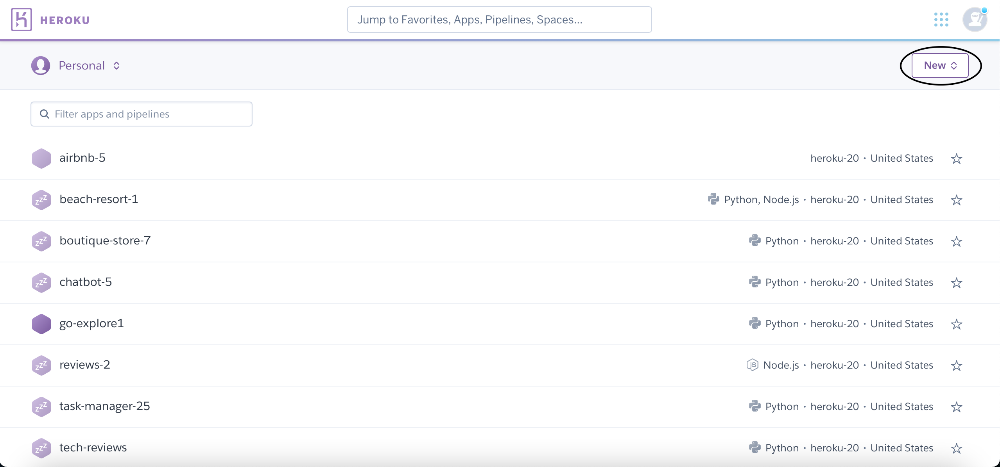
2. Click on the "Create new app" button in the dropdown list.
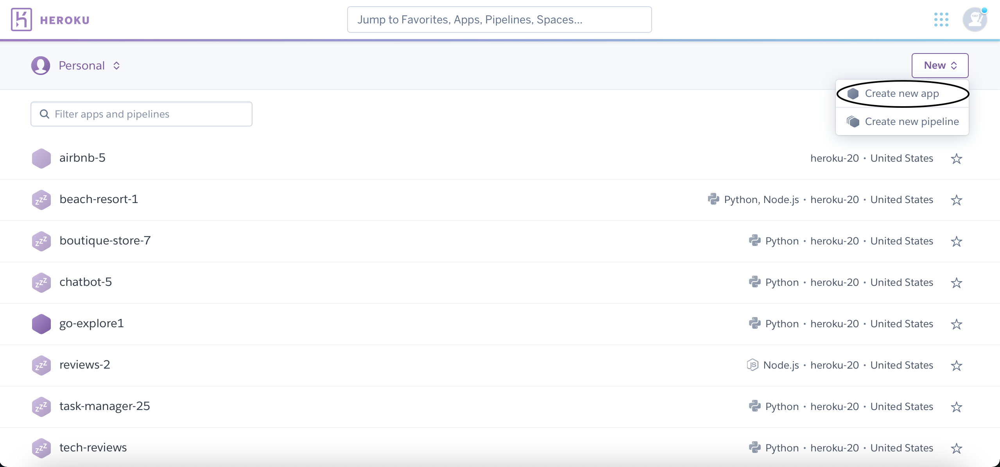
3. Enter a name for the app and check that it is available.

4. Click the "Create app" button.
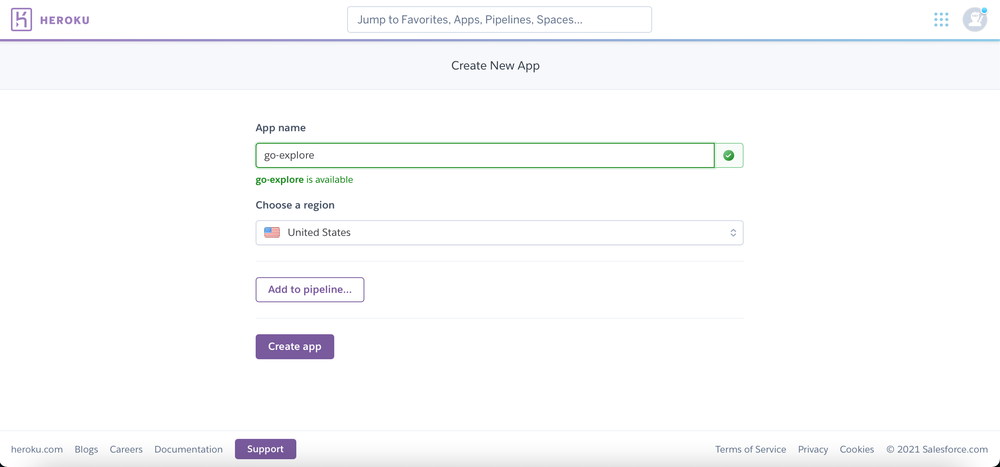
5. Click the "Resources" tab
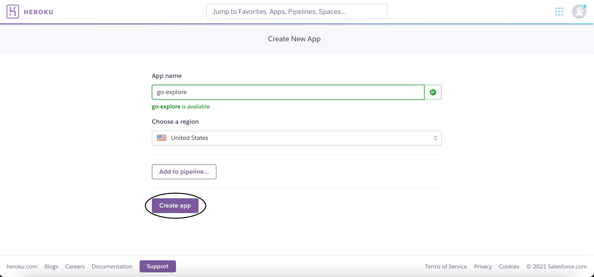
6. Enter "Heroku Postgres" in the search box and click on the "Heroku Postgres" option.
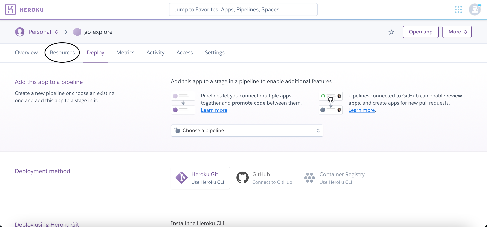
7. Make sure the plan name is set to "Hobby Dev - Free" and click the "provision" button.
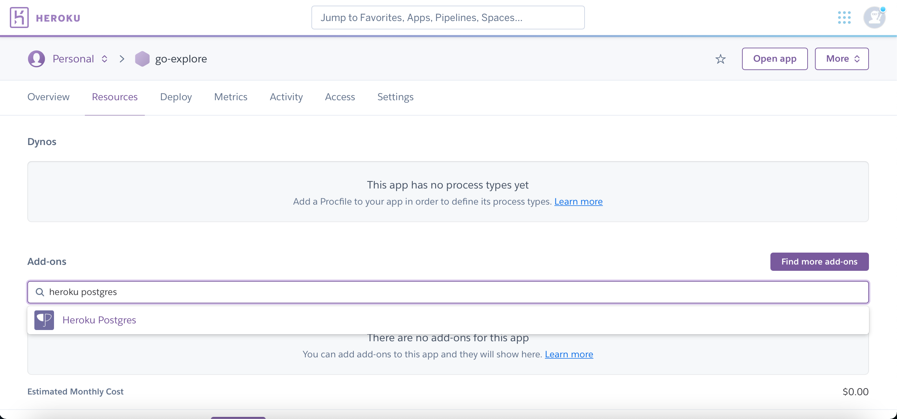
8. Run the commands ```pip3 install dj_database_url``` and ```pip3 install psycopg2```in the terminal to install the neccessary packages to connect to the heroku database.
9. Add the heroku database settings to settings.py
10. Run the command ```python3 manage.py migrate``` in the terminal to migrate the models to the database.
11. Run the command ```python3 manage.py createsuperuser``` in the terminal and enter a username, email address and password for the superuser.
12. Run the command ```pip3 install gunicorn``` in the terminal to install the gunicorn web server.
13. Run the command ```pip3 freeze > requirements.txt``` in the terminal and press enter to create the requirements.txt file.
14. Run the command ``echo web: gunicorn go_explore.wsgi:application > Procfile`` in the terminal and press enter to create the procfile.
15. Commit these changes to GitHub.
16. In Heroku, click on the "deploy" tab
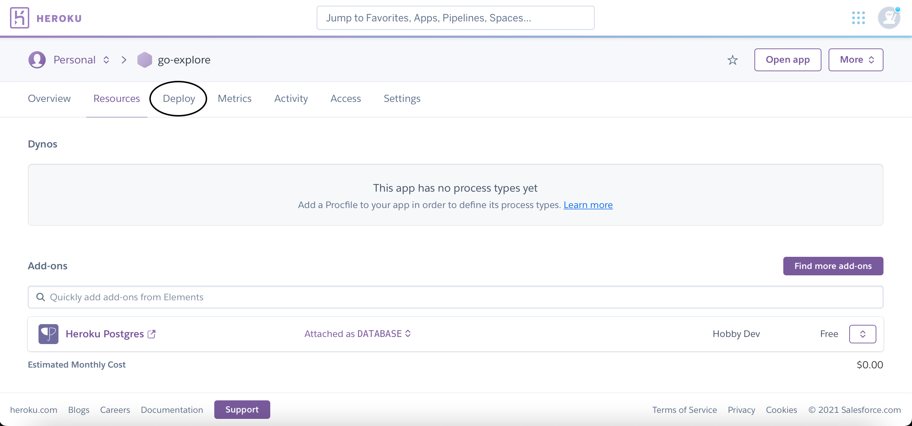
17. Scroll down to the "Deployment Method" section and click on the "Connect to GitHub" button
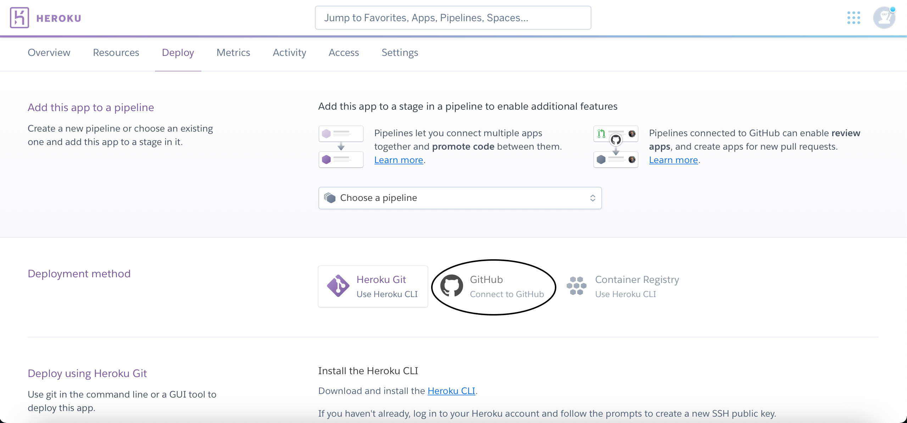
18. Enter the project's GitHub repository name in the repo-name field and click the "Search" button.
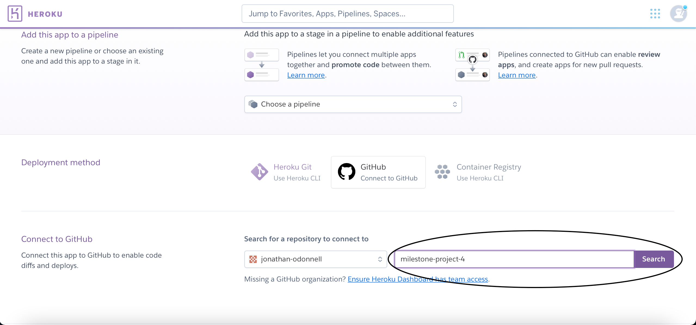
19. Click the "Connect" button next to the GitHub repository.
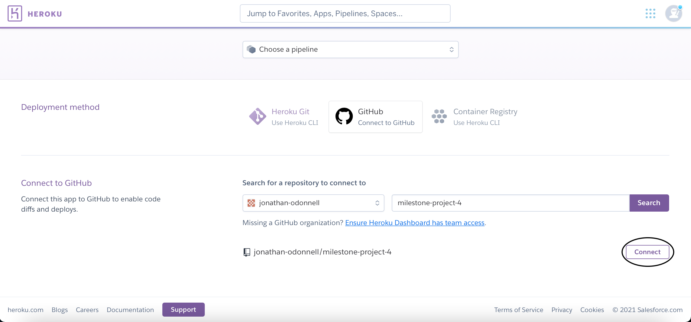
20. Scroll down to the automatic deploys section and click the "Enable Automatic Deploys" button.
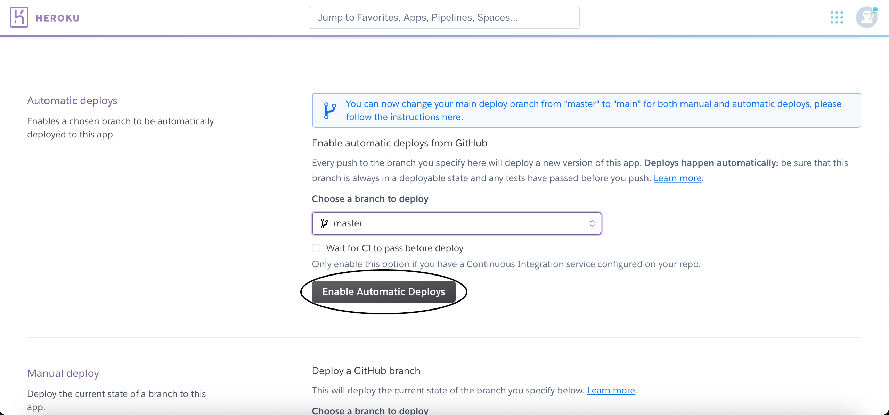
21. Scroll back up to the top of the page and click the "Settings" tab.
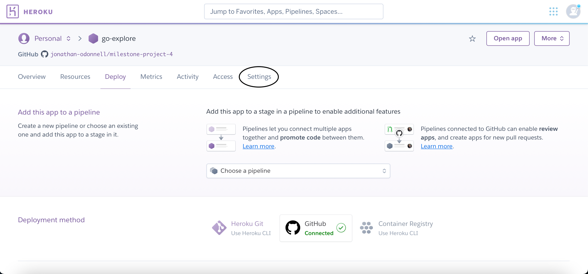
22. Scroll down to the convig vars section and click the "Reveal Config Vars" button.
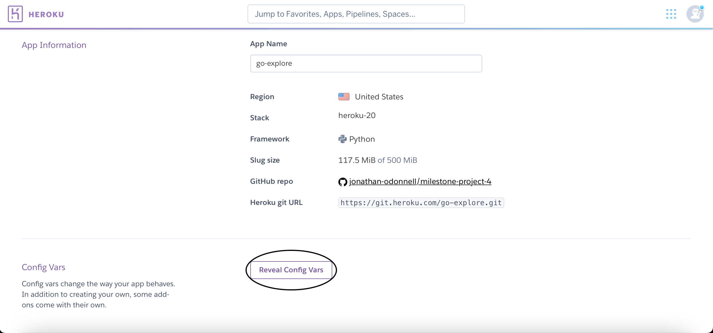
23. For each of the AWS_ACCESS_KEY_ID, AWS_SECRET_ACCESS_KEY, DISABLE_COLLECT_STATIC, EMAIL_HOST_PASSWORD, EMAIL_HOST_USER, GOOGLE_PLACES_KEY, PAYPAL_CLIENT_ID, PAYPAL_CLIENT_SECRET, SECRET_KEY, STRIPE_PUBLIC_KEY, STRIPE_SECRET_KEY, STRIPE_WH_SECRET and USE_AWS, enter the key and value and click the "add" button.
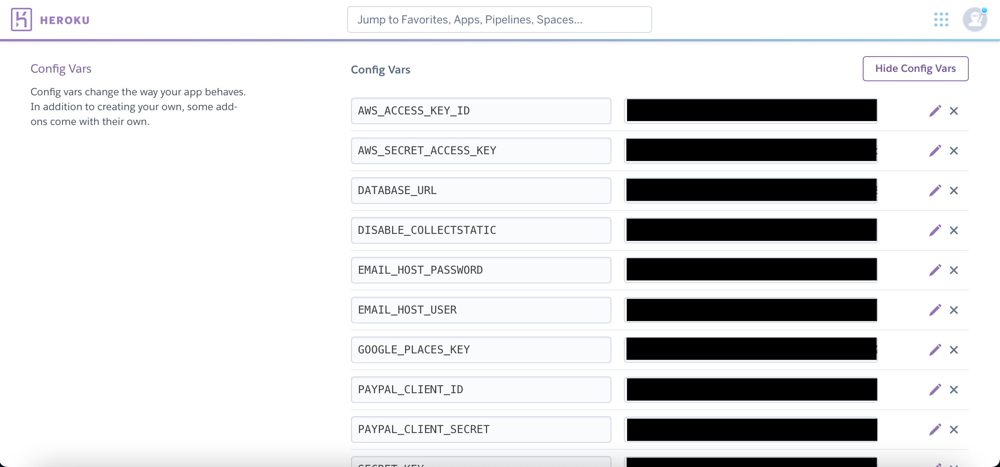

More information about deploying a website to Heroku is available [here](https://devcenter.heroku.com/categories/deployment).

### Forking the GitHub repository

The GitHub Repository can be forked using the following steps:

1.  Log in to GitHub and locate the project's [GitHub Repository](https://github.com/jonathan-odonnell/milestone-project-4).
2.  At the top-right of the repository, click the "Fork" Button.


More information about forking a GitHub repository is available [here](https://docs.github.com/en/github/getting-started-with-github/fork-a-repo).

### Making a Local Clone

A local clone of the project can be created using the following steps:

1. Log in to GitHub and locate the project's [GitHub Repository](https://github.com/jonathan-odonnell/milestone-project-4).
2. Under the repository name, click the "Code" button.

3. To clone the repository using HTTPS, under "Clone with HTTPS", click the clipboard button to copy the repository URL.

To clone using GitHub CLI, click "Use GitHub" CLI and then click the clipboard button.


4.  Open the terminal.
5.  Change the current working directory to the location where you want to store the cloned repository.
6.  Type `git clone` and then paste the URL you copied in Step 3.

```
$ git clone https://github.com/jonathan-odonnell/milestone-project-4.git
```

7.  Press enter to create your clone.

```
Cloning into 'milestone-project-4'...
remote: Enumerating objects: 4783, done.
remote: Counting objects: 100% (190/190), done.
remote: Compressing objects: 100% (106/106), done.
remote: Total 4783 (delta 119), reused 130 (delta 82), pack-reused 4593
Receiving objects: 100% (4783/4783), 78.78 MiB | 3.19 MiB/s, done.
Resolving deltas: 100% (2919/2919), done.
```

More information about making a local clone of a GitHub repository is available [here](https://docs.github.com/en/github/creating-cloning-and-archiving-repositories/cloning-a-repository).

## Credits

### Code

### Content

### Media


