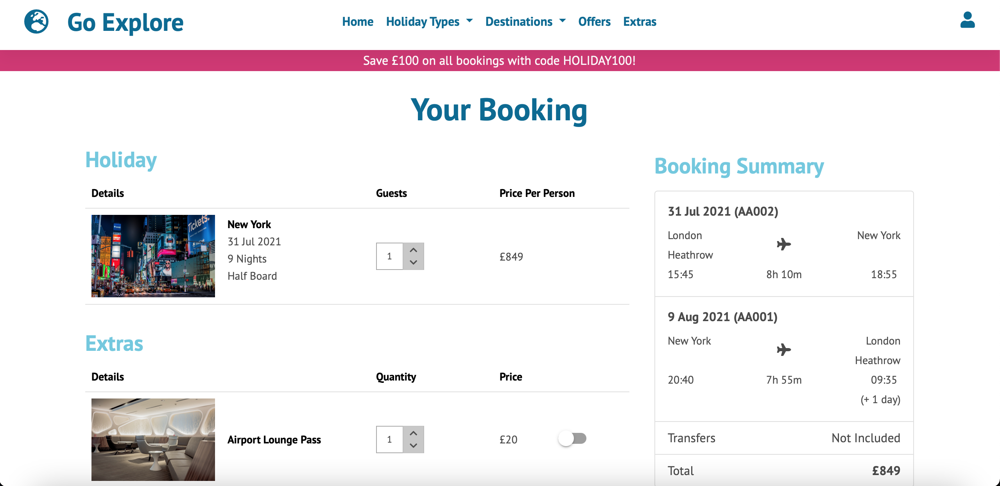
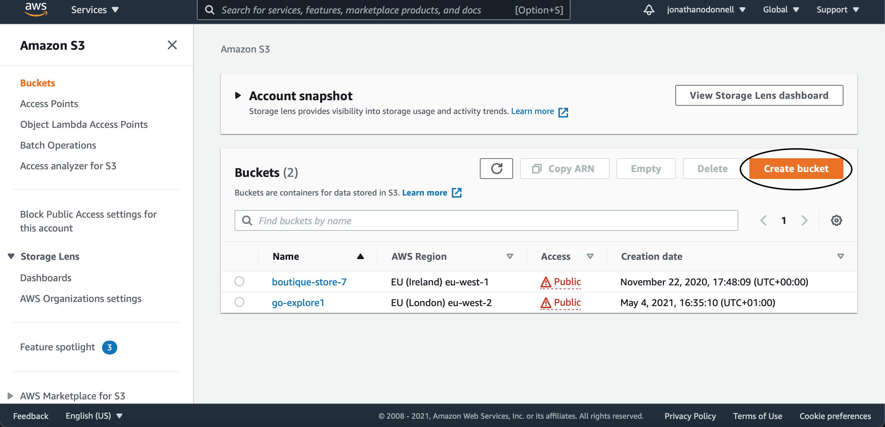

# Go Explore Website


[View the live website here](https://go-explore.herokuapp.com/)

Go Explore is a fictitious travel agency based in Toronto, Canada. This is the organisation's main marketing website which aims to inform customers about the different holiday packages currently available and persuade them to make a purchase. It provides customers with information and reviews for a variety of holiday types including activity holidays, city breaks and resort holidays in a variety of different countries around the world. The website is designed to be responsive and easy to navigate on a range of devices.

## User Experience (UX)

### User Stories

1. As a customer, site user or a site owner, I want to be able to navigate the website easily to find the content I am looking for.
2. As a customer, I want to be able to find out about the latest holiday offers.
3. As a customer, I want to be able to find out about the most popular holiday packages.
4. As a customer, I want to be able to find out about the features that differentiate Go Explore from its competitiors.
5. As a customer, I want to be able to search for holiday packages that meet my needs.
6. As a customer, I want to be able to view details of individual holiday packages.
7. As a customer, I want to be able to find out about the extras that are available.
8. As a customer, I want to be able to easily enter the departure date, departure airport and number of guests when making a booking.
9. As a customer, I want to be able to easily select extras and their quantities when making a booking
10. As a customer, I want to be able to easily enter my personal and payment information and feel that it is safe and secure.
11. As a customer, I want to be able to view a booking confirmation after checkout.
12. As a site user, I want to be able to sign in to my account or sign up for an account if I don't already have one.
13. As a site user, I want to be able to easily recover my password if I forget it.
14. As a site user, I want to be able to view my personal profile and update my profile information.
15. As a site user, I want to be able to view details of my bookings.
16. As a site user, I want to be able to write reviews of the holiday packages I have purchased.
17. As a site user, I want to be able to contact the organisation to get answers to any questions I may have.
18. As a site user, I want to be able to sign up for email updates about the latest holiday offers.
19. As a site user, I want to be able to find the organisation's social media links.
20. As a site owner, I want to be able to add, edit and delete holiday packages.
21. As a site owner, I want to be able to add, edit and delete extras.
22. As a site owner, I want to be able to add, edit and delete flights.

### Design

#### Colour Scheme

- The three main colours used in the website are pink, light blue and dark blue.
- These colours were chosen because they complement each other well.

#### Typography

- The main font used throughout the website is PT Sans.
This font was chosen because it makes the content easy to read.
- Nothing You Could Do was used for the hero image headings to make them stand out.
- Sans Serif is the fallback font which is used in the event that the specified font fails to import into the website correctly.

#### Imagery

- The hero images were chosen because they give the user an idea of what they can expect to experience in each destination if they book a holiday there.

### Wireframes

- [Desktop](static/readme/desktop_wireframes.pdf)
- [Tablet](static/readme/tablet_wireframes.pdf)
- [Mobile](static/readme/mobile_wireframes.pdf)

### Entity Relationship Diagrams

The Entity Relationship Diagram shows details of each field in each model in the database and the relationships between the different models. They can be accessed [here](static/readme/entity_relationship_diagram.pdf).

## Features

### Existing Features

1. Brand Logo

    - This familiarises users with the organisation's logo and is also a link which the user can access from any page to take them back to the home page.

2. Navigation links

    - These enable users to access the different pages of the website so they can easily find the content they are looking for.

3. Home Page Hero Image Carousel

    - This provides users with an image, details of the duration and price and a link to the holiday's details page for three holiday packages currently on offer.

4. Popular Holidays Slider

    - This provides users with cards for six of the most popular holiday packages. Each card contains the holiday's image, name, price country, rating and duration. The name is a link to the holiday's details page. 

5. Features

    - This provides users with up to 3 key features which differentiates Go Explore from its competitors and why they can have confidence when placing a booking with the company.

6. Sign Up Form

    - This allows users to sign up for an account by entering their first name, last name, email address and password into the form.

7. Sign In Form

    - This enables users to sign in to their account by entering their email address and password or by by clicking on the Facebook or Google icons to sign in using their Facebook or Google account.

8. Profile

    - This enables users to update their profile information. If the user changes their email adddress, they will need to re-verify the new email address to continue to be able to access their account.

9. Change Password Form

    - This enables users to change their password.

10. Bookings

    - This displays to logged in users table of the booking number, holiday name and duration, and booking total for each of their bookings. The booking number is a link to the booking's booking details page.

11. Booking Details/Checkout Success

    - This provides the user with a summary of their booking including customer details, booking total breakdown, holiday details, extras details and flights details.

12. Holidays Cards

    - Cards are displayed for all holidays that satisfy the category or destination in the URL. If the user is on the offers page, offers are shown.
    - Each card includes the holiday's image, name, price, country, rating and duration. The name is a link to the holiday's details page.
    - Users can sort the holidays by selecting an option from the sort by select input or filter them by selecting or unselecting the country or category badges.

13. Holiday Details

    - This provides users with details of the holiday package including a description, 5 key features, activities (where applicable), the itinerary (where applicable) and reviews.
    - Links to edit and delete the holiday are displayed when a superuser is logged in.
    - A link to the review page is displayed when a user is logged in who has purchased the holiday and has not already reviewed it.

14. Related Holidays

    - This provides users with cards for four randomly selected related holidays in the category or destination in the URL. If the user is on a offer details page, offers are shown.
    - Each card contains the holiday's image, name, price country, rating and duration. The name is a link to the holiday's details page.

15. Write Review Form

    - This enables logged in users to write a review of their holiday if they have purchased the holiday and not already reviewed it.
    - Every time a new review is added, the holiday's average rating is re-calculated.

16. Trip Booking Form

    - This enables users to select their departure date using the datepicker and enter their departure airport and the number of guests for their booking.

17. Booking Summary

    - This provides users with a summary of their booking including holiday details, number of guests, flight details, whether transfers are included and a breakdown of the booking total.
    - The user can update the number of guests by using the up and down arrow buttons next to the guests input.
    - The extras available for the booking are listed in the extras table.
    - The user can add an extra to the booking by changing the switch next to the relevant extra to the on position or update their quantity by using the up and down arrow buttons next to the quantity input. 
    - The quantity of each extra is limited to the number of guests in the booking.
    - The user can add a coupon code to the booking by entering a valid coupon code in the coupon field and clicking the apply button.

18. Passenger Details

    - This enables users to enter the passengers details including full name, date of birth and passport number. If the user is signed in, the full name for passenger 1 is automatically entered into the relevant field.

19. Checkout

    - This enables the user to enter the booking contact details and pay for their holiday using a card payment, PayPal, Apple Pay or Google Pay. If the user is signed in, their booking contact details are automatically entered into the booking contact details form.
    - Addresses are populated into the booking contact details form when the user begins to enter an address in the address field and selects an option from the autocomplete.
    - Signed in users who have saved a card to their account can select the relevent card under saved cards and enter the CVC rather than having to enter their full card details if they choose to pay by card.

20. Add/Edit Holiday Forms

    - These enable admin users to add a new holiday or edit the details of an existing holiday including package details, features, activities and itineraries.

21. Flights Table

    - This displays to admin users a table of the flight number, origin, destination and links to edit and delete each product for each flight.
    - Admin users can add a new product by clicking on the add flight link or sort the flights by selecting an option from the sort by select input.

22. Add/Edit Flights Forms

    - These enable admin users to add a new flight or edit the details of an exisiting flight.

23. Extra Details

    - This provides users with details of each extra incuding it's name, image, price and description.

24. Add/Edit Extras Forms

    - These enable admin users to add a new extra or edit the details of an existing extra.

25. Contact Us Form

    - This enables users to contact the organisation about any questions they may have by completing the form. If a user is signed in, their full name and email address are automatically entered into the relevant form fields.

26. Footer Navigation links

    - These enable users to access key different pages of the website so they can easily find the content they are looking for.

27. Newsletter Sign Up

    - This enables users to sign up to receive updates about the latest products by entering their email address into the form.

28. Social Media links

    - These provide users with links to the different social media platforms where the organisation has a presence.

29. Responsive Design

    - Bootstrap grids and CSS media queries are used throughout the website to ensure that it is optimised for use on devices with a wide range of screen sizes.

### Features Left To Implement

1. More Destinations
   - Add more destinations including from more countries and more holiday categories.

2. Flight and Holiday Package Capacity Limits
    - Add a capacity limits to the flights and packages model and add a date selection page where the user can only select dates with available capacity.

3. Different Prices on Different Dates
    - Add a prices model and functionality to search holidays by departure date.

4. Buy Now Pay Later Payment Option
    - Add a payment option where the customer can split the payment over a series of monthly payments. 

5. Add Paypal Payments Webhooks
    - Add webhooks for paypal payments to ensure that the booking is updated if the user closes the checkout page after payment has been approved but before the form has been submitted. 

6. Include Visa Information in Confirmation Email
    - Amend the confirmation email to include visa information for the relevant destination.

7. Manage Payment Methods from Profile
    - Add an additional page to the profile app where the user can add, update and delete their payment methods.

8. Amend Booking
    - Add functionality to the bookings page to be able to submit a request to amend a booking.

## Technologies Used

### Languages Used

1. [HTML5:](https://en.wikipedia.org/wiki/HTML5/)
   - HTML5 was used for the sturcture of the webpages.
2. [CSS3:](https://en.wikipedia.org/wiki/Cascading_Style_Sheets/)
   - CSS3 was used for the styling of the webpages.
3. [JavaScript:](https://en.wikipedia.org/wiki/JavaScript/)
   - JavaScript was used for the interactive features on the webpages.
4. [Python:](https://www.python.org/)
    - Python was used to communicate the database information to the browser.

### Frameworks, Libraries & Programs Used

1. [Bootstrap 5](https://getbootstrap.com/)
   - Bootstrap was used for the navbar, buttons, dropdowns, tabs, cards, badges, pagination, switches, tables and toasts. Bootstrap was also used for the grid which assists with the responsiveness of the website and for the styling.
2. [Material Design Bootstrap](https://mdbootstrap.com/)
    - The Material Design Bootstrap theme was used for the styling of the website.
3. [Google Fonts](https://fonts.google.com/)
   - Google fonts was used to import the 'PT Sans' and 'Nothing You Could Do' fonts into the style.css file.
4. [Hover.css](https://ianlunn.github.io/Hover/)
   - Hover.css was used for the hover effects on the social media icons.
5. [Font Awesome](https://fontawesome.com/)
   - Font Awesome was used throughout the website to enhance the user experience by adding icons.
6. [jQuery](https://jquery.com/)
   - JQuery was used throughout the website for the interactive features.
7. [Slick](https://kenwheeler.github.io/slick/)
    - Slick was used for the offers carousel, popular holidays slider and related holidays sliders. The license can be viewed [here](slick_license.md).
8. [Gijgo](https://gijgo.com/)
    - Gijgo was used for the datepicker and datetime picker.
9. [jQuery Formset](https://github.com/nortigo/jquery-formset)
    - JQuery formset was used to dynamically add rows to the formsets in the add holiday and edit holiday forms. The license can be viewed [here](jquery_formset_license.md).
10. [Pytz](https://pypi.org/project/pytz/)
    - Pytz was used for the coverting of time zones.
11. [Stripe](https://stripe.com/docs/payments)
    - The Stripe API was used for the processing of card, Apple Pay and Google Pay payments.
12. [Paypal](https://developer.paypal.com/docs/checkout/)
    - The Paypal Smart Payment Button API was used for the processing of Paypal Payments.
13. [Google Places Autocomplete API](https://developers.google.com/maps/documentation/javascript/places-autocomplete)
    - Google Places Autocomplete API was used for the address autocomplete on the profile and checkout pages.
14. [Django](https://www.djangoproject.com/)
    - Django was used for the accessing of the data models, the routing of the appliction, the messages and the templating.
15. [Django Allauth](https://django-allauth.readthedocs.io/en/latest/installation.html)
    - Django allauth was used for the authentication of users.
16. [Postgresql](https://www.postgresql.org/)
    - A postgresql database was used to store the data used in the project.
17. [Visual Studio Code](https://code.visualstudio.com/)
    - Visual Studio Code was used to write the code for this project and gitpod terminal was used to commit changes to Git and push them to GitHub.
18. [Git](https://git-scm.com/)
    - Git was the version control system used for this project.
19. [GitHub](https://github.com/)
    - GitHub is used to store the project's code and any other required files.
20. [Heroku](https://www.heroku.com/)
    - Heroku is used to host the deployed website.
21. [Amazon Web Services](https://aws.amazon.com)
    - An Amazon Web Services S3 bucket was used to host the images and static files used in the website
22. [Balsamiq](https://balsamiq.com/)
    - Balsamiq was used to create the wireframes during the design phase of the project.
23. [DB Diagram](https://dbdiagram.io/home)
    - DB Diagram was used to create the Entity Relationship Diagrams of the database.

## Testing

### Validation and Lighthouse Testing

<!-- Code for left aligning the table columns is from https://www.markdownguide.org/extended-syntax/ -->

| Test                 | Outcome                                           |
| :------------------- | :------------------------------------------------ |
| W3C Markup Validator | No errors except for the django templating syntax |
| W3C CSS Validator    | No errors |
| PEP8                 | No errors                                         |
| JSHint               | No errors except for jQuery syntax and warnings for ES6 syntax |
| Lighthouse           | Accessibility test result was approximately 97% and performace test result was approximately 60% - 80% on each page. Opportunities for improvement include ensuring that there is a sufficient conttrast between background and foreground colours, ensuring that heading elements are in a sequentially descending order and properley sizing images. |

### Testing User Stories from User Experience (UX) Section


1. As a user or a site owner, I want to be able to navigate the website easily to find the content I am looking for.

    - The navigation bar can be easily accessed in the header of each page.
    - It is clean and easy to read and contains the organisation's logo and the navigation links to the other pages of the website.
    - Each of the navigation links clearly communicates to the user what page it will take them to.
    - The Go Explore brand logo is also a link which takes the user back to the home page.
    - The footer also contains key links which take the user to the holiday categories pages, offers page, extras page, contact page and the profile page and bookings page if a standard user is signed in.
    - The website is structured in a logical way with the hero image carousel, popular holidays and features on the home page, and each other item of content on its own page. 


2. As a customer, I want to be able to find out about the latest holiday offers.

    - The hero image carousel is clearly highlighted on the home page.
    - Here the customer can find information about three of the latest offers including the holiday package's image, name, price and duration.
    - If the customer clicks on the 'Explore Now' button, they are taken to the holiday's details page where they can find out more about the holiday package.


3. As a customer, I want to be able to find out about the most popular holiday packages.

    - The popular holidays slider is clearly highlighted on the home page.
    - This contains cards for six popular holiday packages which include details of the holiday's image, name, price country, rating and duration.
    - If the customer clicks on the name, they are taken to the holiday's details page where they can find out more about the holiday package.


4. As a customer, I want to be able to find out about the features that differentiate Go Explore from its competitiors.

    - The features section is clearly highlighted on the home page.
    - Here the customer is provided with up to 3 key features which differentiates Go Explore from its competitors and why they can have confidence when placing a booking with the company.


5. As a customer, I want to be able to search for holiday packages that meet my needs.

    - The holiday types, destinations and offers pages are clearly highlighted in the navigation bar in the header of each page.
    - For each holiday in the category or destination in the URL, a card which includes the holiday's image, name, price, country, rating and duration is displayed. The name is a link to the holiday's details page.
    - If the customer would like to sort the holidays, they can select an option from the sort by dropdown.
    - If the customer would like to filter the holidays, they can select country or category badges.


6. As a customer, I want to be able to view details of individual holiday packages.

    - Customers can access a holiday's details page by clicking on a holiday's name on the holiday types, destinations or the offers details pages.
    - Here the customer is provided with information about the holiday package including a description, five key features, activities (where applicable), the itinerary (where applicable) and reviews.


7. As a customer, I want to be able to find out about the extras that are available.

    - The extras link is clearly highlighted in the navigation bar in the header of each page.
    - If the customer clicks on this link, they are taken to the extras page page where they find out about each extra incuding it's name, image, price and description.


8. As a customer, I want to be able to easily enter the departure date, departure airport and number of guests when making a booking.

    - The booking form is clearly highlighted on the holiday details pages.
    - Here the customer can select their departure date using the datepicker and enter their departure airport and the number of guests for their booking.




9. As a customer, I want to be able to easily select extras and their quantities when making a booking

    - The extras section is clearly highlighted on the booking page.
    - Here the customer can select the extras they would like to add to their booking by changing the extra's switch to the on position.
    - The customer can increase or decrease the quantity of the extra by using the up and down arrow buttons next to the quantity input.


10. As a customer, I want to be able to easily enter my personal and payment information and feel that it is safe and secure.

    - The passenger details sections are clearly highlighted on the passenger details page.
    - Here the customer can enter the full name, date of birth and passport number for each guest in the booking.
    - The booking contact section is clearly highlighted on the checkout page.
    - Here the customer can enter the contact details for the booking contact.
    - The express payment and card payment sections are clearly highlighted on the checkout page.
    - Here the customer can enter the relevant details to complete the payment.
    - Customers can feel confident that the checkout process is safe and secure as it is quick and easy to check out and no unneccessary information is requested.


11. As a customer, I want to be able to view a booking confirmation after checkout.

    - Once the customer has successfully paid for their booking, the checkout success page is displayed.
    - Here the customer will find a summary of their booking including billing information, holiday details, extras, and flight details.
    - The customer will also receive a booking confirmation email.


12. As a site user, I want to be able to sign in to my account or sign up for an account if I don't already have one.

    - The sign in / register links are clearly highlighted in the user options dropdown.
    - On the sign in page, users can sign in to their account by entering their email address and password into the sign in form or by clicking on the google or facebook icon and signing into the relevant account.
    - On the register page, users can sign up for an account by entering their details into the sign up form.


13. As a site user, I want to be able to easily recover my password if I forget it.

    - The profile link is clearly highlighted on the sign in page.
    - If the user clicks on this link, they are taken to the password reset page page where they can request a password reset link.


14. As a site user, I want to be able to view my personal profile and update my profile information.

    - The profile link is clearly highlighted in the user options dropdown when the user is signed in.
    - If the user clicks on this link, they are taken to the profile page where they can view and update their profile details.


15. As a site user, I want to be able to view details of my bookings.

    - The bookings link is clearly highlighted in the user options dropdown when the user is signed in.
    - If the user clicks on this link, they are taken to the bookings page which contains a table displays the booking number, departure date, holiday name, duration and total for each booking they have made.
    - If the user clicks on a booking number, they are taken to the booking details page which includes full details of the booking.


16. As a site user, I want to be able to write reviews of the holiday packages I have purchased.

    - The add review link is clearly highlighted on the holiday details pages when the user is signed in, has purchased the holiday and not already reviewed it.
    - If the user clicks on this link, they are taken to the write review page which contains a form they can complete to add a review for the holiday.


17. As a site user, I want to be able to contact the organisation to get answers to any questions I may have.

    - A link to the contact us page is clearly highlighted in the footer of each page.
    - Here there is a form which the user can complete to get in touch with the organisation.


18. As a site user, I want to be able to sign up for email updates about the latest holiday offers.

    - The newsletter sign up section is clearly highlighted in the footer of each page.
    - This contains a form where users can enter their email address to sign up to receive email updates about the latest holiday offers.

19. As a site user, I want to be able to find the organisation's social media links.

    - The social media icons are clearly highlighted in the footer of each page.
    - Each of these provides a link to the relevant social media platform.


20. As a site owner, I want to be able to add, edit and delete holiday packages.

    - Site owners can access the add holiday form by clicking on the user dropdown and selecting the add holiday option. Here, they can complete the form to add a new holiday.
    - If the site owner clicks on the edit link below the description on the relevant holiday details page, the edit holiday form is displayed where they can amend the relevant holiday details.
    - If the site owner clicks on the delete link below the description on the relevant holiday details page, the holiday is deleted.


21. As a site owner, I want to be able to add, edit and delete extras.

    - Site owners can access the add extra form by clicking on the user dropdown and selecting the add extra option. Here, they can complete the form to add a new extra.
    - If the site owner clicks on the edit link below the relevant extra on the extras page, the edit extra form is displayed where they can amend the relevant extra details.
    - If the site owner clicks on the delete link below the relevant extra on the extras page, the extra is deleted.


22. As a site owner, I want to be able to add, edit and delete flights.
    
    - Site owners can access the flights page by clicking on the user dropdown and selecting the flights option.
    - Here, site owners can find a table containing each flight's flight number, origin, destination and links to the edit and delete the flight.
    - If the site owner clicks on the add flight link, the add flight form is displayed which they can complete to add a new flight.
    - If the site owner clicks on a flight's edit link, the edit flight form is displayed where they can amend the relevant flight details.
    - If the site owner clicks on a flight's delete link, the flight is deleted.

### Manual Testing

Details of the manual testing carried out can be viewed [here](testing.md).

### Further Testing

- The Website was tested on a variety of different web browsers including Google Chrome, Microsoft Edge, Safari and Firefox.
- The Website was also viewed on a number of different devices with a range of screen widths including an iMac, MacBook, iPad and iPhone.
- Family and friends were asked to review the site and documentation and identify any bugs or other issues that were affecting the user experience.

### Fixed Bugs

1. Many to Many fields in the Package form were not saving
    - Fixed an error in the code.

2. Non UK addresses were being populated to the wrong form fields by the address autocomplete
    - Restricted the autocomplete to UK addresses

3. Times were appearing in the wrong time zone
    - Added time zone fields to the flights model and added logic to the flight model save method to convert departure time and arrival time to UTC.

4. Itineraries were appearing in the wrong order on the holiday details pages
    - Added sorting by ID to the itineraries model meta class

5. All bookings were appearing on the bookings page, no matter how many
    - Used the slice filter in the template to restrict the number of bookings shown to 10.

6. Filters and sorting previously selected on the flights and holidays pages were not being re-applied when the user clicked the back button
    - Added a new entry to the browser's session history every time the filters or sorting are changed.

7. Payments made using Apple Pay or Google Pay were not being processed successfully
    - Fixed an error in the code.

8. The email address was not being saved when the profile was saved
    - Fixed an error in the code.

## Deployment

### Amazon Web Services S3 Bucket

The project's media and static files were stored in an Amazon Web Services S3 bucket using the following steps:

1. Log in to Amazon Web Services, enter "s3" into the search bar and click on the s3 result.

2. Click on the "create bucket" button.

3. Enter a name for the bucket.

4. Uncheck the "Block all public access" checkbox.

5. Check the "I acknowledge that the current settings might result in this bucket and the objects within it becoming public" checkbox.

6. Click on the "create bucket" button.

7. Click on the "go-explore-1" bucket.

8. Click on the "properties" tab.

9. Scroll down to the "Static website hosting" section and click on the "edit" button.

10. Under "static website hosting" select the enable option.

11. Enter the index document and error document details.

12. Click on the "save changes" button.

13. Click on the "permissions" tab.

14. Scroll down to the "cross-origin resource sharing" section and click on the "edit" button.

15. Add the CORS configuration.

16. Click on the "save changes" button.

17. Scroll down to the "bucket policy" section and click on the "edit" button.

18. Click on the "policy generator" button.

19. Select the policy type, enter the policy statements and click on the "add statement" button.

20. Click on the "generate policy" button.

21. Copy the policy and click on the "close" button.

22. Paste the policy into the policy section and amend the resource to include subdirectories in the bucket.

23. Click on the "save changes" button.

24. Scroll down to the "access control list" and click on the "edit" button.

25. Select the "everyone (public access)" checkbox.

26. Click on the "save changes" button.

27. Enter "IAM" into the search bar and click on the s3 result.

28. Click on the "user groups" link.

29. Click on the "create group" button.

30. Enter a group name.

31. Click on the "save changes" button.

32. Click on the "policies" link.

33. Click on the "create policy" button.

34. Click on the "JSON" button.

35. Click on the "import managed policy" link.

36. Search for "s3", select the "AmazonS3FullAccess" option and click on the "import" button.

37. Amend the resource to include subdirectories in the bucket and click on the "next" button.

38. Click on the "next" button.

39. Enter a policy name and description.

40. Click on the "create policy" button.

41. Click on the "user groups" link.

42. Click on the "manage-go-explore" user group.

43. Click on the "permissions" tab.

44. Click on the "add permissions" button.

45. Click on the "attach policies" button.

46. Select the "manage-go-explore" option.

47. Click on the "add policies" button.

48. Click on the "users" link.

49. Click on the "add user" button.

50. Enter a user name, select "programmatic access" under access type and click on the "next" button.

51. Select the "manage-go-explore" user group and click on the "next" button.

52. Click on the "next" button.

53. Click on the "create user" button.

54. Click on the "download .csv" button and then click on the "close" button.

55. Click on the "services" button and then click on "s3" under recently visited.

56. Click on the "go-explore-1" bucket.

57. Click on the "create folder" button.

58. Enter "media" in the folder name field and click on the "create folder" button.

59. Click on the "media" folder.

60. Click on the "upload" button.

61. Click on the "add files" button and select the files to upload from your workspace media directory.

62. Under permissions select the "grant public-read access" option.

63. Select the "I understand the risk of granting public access to the specified objects" checkbox and click on the "upload" button.

64. Run the command ```pip3 install boto3``` and ```pip3 install django-storages``` in the terminal to install the neccessary packages to connect to the Amazon Web Services s3 bucket.
65. Add "storages" to installed apps and add the Amazon Web Services s3 bucket settings to the static and media settings in settings.py
66. Commit these changes to GitHub.

### Heroku

The project was deployed to Heroku using the following steps:

1. Log in to Heroku and click on the "new" button.

2. Click on the "create new app" button in the dropdown list.

3. Enter a name for the app and check that it is available.

4. Click the "create app" button.

5. Click the "resources" tab

6. Enter "heroku postgres" in the search box and click on the "heroku postgres" option.

7. Make sure the plan name is set to "hobby dev - free" and click the "provision" button.

8. Run the commands ```pip3 install dj_database_url``` and ```pip3 install psycopg2```in the terminal to install the neccessary packages to connect to the heroku database.
9. Add the heroku database settings to settings.py
10. Run the command ```python3 manage.py migrate``` in the terminal to migrate the models to the database.
11. Run the command ```python3 manage.py createsuperuser``` in the terminal and enter a username, email address and password for the superuser.
12. Run the command ```pip3 install gunicorn``` in the terminal to install the gunicorn web server.
13. Run the command ```pip3 freeze > requirements.txt``` in the terminal and press enter to create the requirements.txt file.
14. Run the command ``echo web: gunicorn go_explore.wsgi:application > Procfile`` in the terminal and press enter to create the procfile.
15. Commit these changes to GitHub.
16. In Heroku, click on the "deploy" tab

17. Scroll down to the "deployment method" section and click on the "connect to GitHub" button

18. Enter the project's GitHub repository name in the repo-name field and click the "search" button.

19. Click the "connect" button next to the GitHub repository.

20. Scroll down to the automatic deploys section and click the "enable automatic deploys" button.

21. Scroll back up to the top of the page and click the "settings" tab.

22. Scroll down to the convig vars section and click the "reveal config vars" button.

23. For each of the AWS_ACCESS_KEY_ID, AWS_SECRET_ACCESS_KEY,EMAIL_HOST_PASSWORD, EMAIL_HOST_USER, GOOGLE_PLACES_KEY, PAYPAL_CLIENT_ID, PAYPAL_CLIENT_SECRET, SECRET_KEY, STRIPE_PUBLIC_KEY, STRIPE_SECRET_KEY, STRIPE_WH_SECRET and USE_AWS, enter the key and value and click the "add" button.


More information about deploying a website to Heroku is available [here](https://devcenter.heroku.com/categories/deployment).

### Forking the GitHub repository

The GitHub Repository can be forked using the following steps:

1.  Log in to GitHub and locate the project's [GitHub Repository](https://github.com/jonathan-odonnell/milestone-project-4).
2.  At the top-right of the repository, click the "fork" Button.


More information about forking a GitHub repository is available [here](https://docs.github.com/en/github/getting-started-with-github/fork-a-repo).

### Making a Local Clone

A local clone of the project can be created using the following steps:

1. Log in to GitHub and locate the project's [GitHub Repository](https://github.com/jonathan-odonnell/milestone-project-4).
2. Under the repository name, click the "code" button.

3. To clone the repository using HTTPS, under "clone with HTTPS", click the clipboard button to copy the repository URL.

To clone using GitHub CLI, click "use GitHub" CLI and then click the clipboard button.


4.  Open the terminal.
5.  Change the current working directory to the location where you want to store the cloned repository.
6.  Type `git clone` and then paste the URL you copied in Step 3.

```
$ git clone https://github.com/jonathan-odonnell/milestone-project-4.git
```

7.  Press enter to create your clone.

```
Cloning into 'milestone-project-4'...
remote: Enumerating objects: 4783, done.
remote: Counting objects: 100% (190/190), done.
remote: Compressing objects: 100% (106/106), done.
remote: Total 4783 (delta 119), reused 130 (delta 82), pack-reused 4593
Receiving objects: 100% (4783/4783), 78.78 MiB | 3.19 MiB/s, done.
Resolving deltas: 100% (2919/2919), done.
```

More information about making a local clone of a GitHub repository is available [here](https://docs.github.com/en/github/creating-cloning-and-archiving-repositories/cloning-a-repository).

## Credits

### Code

- Code for the navbar is from [Bootstrap](https://getbootstrap.com/docs/5.0/components/navbar/).
- Code for the form input groups is from [Bootstrap](https://getbootstrap.com/docs/5.0/forms/input-group/).
- Code for making the back to top button appear when the user scrolls is from [Codepen](https://codepen.io/deveb22/pen/QxPmGz).
- Code for the back to top button smooth scroll is from [Stack Overflow](https://stackoverflow.com/questions/15935318/smooth-scroll-to-top).
- Code for the insertBefore jQuery method is from [jQuery](https://api.jquery.com/insertBefore/#insertBefore-target).
- Code for the jQuery insertAfter method is from [jQuery](https://api.jquery.com/insertAfter/#insertBefore-target).
- Code for the hero image carousel and the sliders is from [Ken Wheeler](https://kenwheeler.github.io/slick/).
- Code for accessing a form's model data in a template is from [Stack Overflow](https://stackoverflow.com/questions/3137984/how-to-access-model-data-when-overriding-django-admin-templates) and [Stack Overflow](https://stackoverflow.com/questions/5002182/how-can-i-access-the-model-instance-used-by-a-form-from-a-template).
- Code for the formset templating is from [Django](https://docs.djangoproject.com/en/3.2/topics/forms/formsets/).
- Code for the badges is from [Bootstrap](https://getbootstrap.com/docs/5.0/components/badge/).
- Code for the cards is from [Bootstrap](https://getbootstrap.com/docs/5.0/components/card/) and [Bootstrap]( https://getbootstrap.com/docs/5.0/utilities/flex/#media-object/).
- Code for floatformat filter is from [Django](https://docs.djangoproject.com/en/3.2/ref/templates/builtins/#floatformat).
- Code for the holidays cards hover effect is from [Codepen](https://codepen.io/kanishkkunal/pen/emdxLm).
- Code for the pagination is from [Bootstrap](https://getbootstrap.com/docs/5.0/components/pagination/ ) and [Django](https://docs.djangoproject.com/en/3.2/topics/pagination/)
- Code for the holiday details tabs is from [Material Design Bootstrap](https://mdbootstrap.com/docs/standard/navigation/tabs/).
- Code for the holiday details tab dropdown is from [Bootstrap](https://getbootstrap.com/docs/5.0/components/dropdowns/).
- Code for accessing a related field in a template is from [Stack Overflow](https://stackoverflow.com/questions/33487424/how-to-get-related-field-in-django-template).
- Code for the tables is from [Bootstrap](https://getbootstrap.com/docs/5.0/content/tables/).
- Code for switches is from [Bootstrap](https://getbootstrap.com/docs/5.0/forms/checks-radios/#switches).
- Code for the list groups is from [Bootstrap](https://getbootstrap.com/docs/5.0/components/list-group/) and [Bootstrap](https://getbootstrap.com/docs/5.0/utilities/flex/).
- Code for the unstled lists is from [Bootstrap](https://getbootstrap.com/docs/5.0/content/typography/#unstyled).
- Code for the toasts if from [Bootstrap](https://getbootstrap.com/docs/5.0/components/toasts/).
- Code for the social account links styling is from [Bbbootstrap](https://bbbootstrap.com/snippets/login-form-footer-and-social-media-icons-55203607).
- Code for the time filter is from [Django](https://docs.djangoproject.com/en/3.2/ref/templates/builtins/#time).
- Code for the wrap jQuery method is from [jQuery](https://api.jquery.com/wrap/#wrap-wrappingElement/).
- Code for slice filter is from [Django](https://docs.djangoproject.com/en/3.2/ref/templates/builtins/#slice).
- Code for for updating the address input's parent element's ID is from [Stack Overflow](https://stackoverflow.com/questions/10219396/jquery-update-element-id/).
- Code for the autocomplete is from [Google](https://developers.google.com/maps/documentation/javascript/examples/places-autocomplete-addressform/).
- Code for the jQuery hasClass method is from [jQuery](https://api.jquery.com/hasclass/). 
- Code for triggering the change event is from [Stack Overflow](https://stackoverflow.com/questions/3179385/val-doesnt-trigger-change-in-jquery/).
- Code for the jQuery each method is from [jQuery](https://api.jquery.com/jquery.each/).
- Code for checking if a checkbox is checked is from [Stack Overflow](https://stackoverflow.com/questions/7960208/jquery-if-checkbox-is-checked/).
- Code for checking or unchecking the switches is from [Stack Overflow](https://stackoverflow.com/questions/426258/setting-checked-for-a-checkbox-with-jquery).
- Code for the datepicker and datetimepicker min date is from [Gijgo](https://gijgo.com/datepicker/configuration/minDate).
- Code for the datepicker and datetimepicker max date is from [Gijgo](https://gijgo.com/datepicker/configuration/maxDate).
- Code for the datetimepicker configuration is from [Gijgo](https://gijgo.com/datetimepicker/) and [Gijgo](https://gijgo.com/datetimepicker/configuration).
- Code for the datepicker configuration is from [Gijgo](https://gijgo.com/datepicker/) and [Gijgo](https://gijgo.com/datepicker/configuration).
- Code for updating a URL object's pathname is from [Mozilla](https://developer.mozilla.org/en-US/docs/Web/API/URL/pathname).
- Code for adding a new entry to the browser's session history is from [Mozilla](https://developer.mozilla.org/en-US/docs/Web/API/History/pushState).
- Code for the delegated target jQuery is from [jQuery](https://api.jquery.com/event.delegateTarget/#event-delegateTarget1).
- Code for the toggleClass jQuery method is from [jQuery](https://api.jquery.com/toggleClass/#toggleClass1).
- Code for the PayPal smart button is from [PayPal](https://developer.paypal.com/docs/checkout/integrate/).
- Code for the PayPal payment form validation is from [PayPal](https://developer.paypal.com/docs/checkout/integration-features/validation/).
- Code for setting up the PayPal transaction on the server is from [PayPal](https://developer.paypal.com/docs/checkout/reference/server-integration/set-up-transaction/) and [Stack Overflow](https://stackoverflow.com/questions/43606056/proper-django-csrf-validation-using-fetch-post-request).
- Code for capturing the PayPal transaction funds on the server is from [PayPal](https://developer.paypal.com/docs/checkout/reference/server-integration/capture-transaction/) and [Stack Overflow](https://stackoverflow.com/questions/43606056/proper-django-csrf-validation-using-fetch-post-request).
- Code for mounting the cvc element and unmounting the card element is from [Stripe](https://stripe.com/docs/js/element/other_methods/).
- Code for creating the cvc element is from [Stripe](https://stripe.com/docs/payments/save-during-payment).
- Code for saving the card is from [GitHub]( https://github.com/stripe-samples/saving-card-after-payment/blob/master/using-webhooks/client/script.js#L86-L91).
- Code for charging a saved card is from [Stripe](https://stripe.com/docs/payments/save-during-payment).
- Code for showing the spinner on the pay button when clicked is from [Stripe](https://stripe.com/docs/payments/integration-builder). 
- Code for the payment request button and handling payment request button payments and form submission is from [Stripe](https://stripe.com/docs/stripe-js/elements/payment-request-button).
- Code for disabling the payment request button if the form is not valid is from [StackOverflow](https://stackoverflow.com/questions/53707534/how-can-i-disable-the-stripe-payment-request-button-until-a-form-is-complete).
- Code for list_per_page, filter_horizontal, list_filter in the admin view is from [Django](https://docs.djangoproject.com/en/3.2/ref/contrib/admin/#modeladmin-options).
- Code to hide the sidebar and change the site header text in the admin view is from [Django](https://docs.djangoproject.com/en/3.2/ref/contrib/admin/#adminsite-attributes).
- Code for returning a distinct values list from a model is from [Stack Overflow](https://stackoverflow.com/questions/10848809/django-model-get-distinct-value-list).
- Code for processing JSON requests is from [Stack Overflow](https://stackoverflow.com/questions/8587693/django-request-is-ajax-returning-false).
- Code for redering the holiday cards template to a string is from [Stack Overflow](https://stackoverflow.com/questions/50879653/django-render-template-in-template-using-ajax).
- Code for randomly ordering a queryset is from [Django](https://docs.djangoproject.com/en/3.2/ref/models/querysets/#order-by).
- Code for excluding from a queryset is from [Django](https://docs.djangoproject.com/en/3.2/ref/models/querysets/#exclude).
- Code for returning the first result in a queryset is from [Django](https://docs.djangoproject.com/en/3.2/ref/models/querysets/#first).
- Code for accessing the previous URL is from [Stack Overflow](https://stackoverflow.com/questions/27325505/django-getting-previous-url).
- Code for the slug fields is from [Django Extensions](https://django-extensions.readthedocs.io/en/latest/field_extensions.html).
- Code for removing the accents from a string is from [Stack Overflow](https://stackoverflow.com/questions/33328645/how-to-remove-accent-in-python-3-5-and-get-a-string-with-unicodedata-or-other-so).
- Code for the default ordering of a model is from [Stack Overflow](https://docs.djangoproject.com/en/3.2/ref/models/options/#ordering).
- Code for the average aggregation method is from [Django](https://docs.djangoproject.com/en/3.2/topics/db/aggregation/#cheat-sheet). 
- Code for the Crispy Forms form helper is from [Django](https://django-crispy-forms.readthedocs.io/en/latest/form_helper.html).
- Code for the inline formsets is from [Dev Community](https://dev.to/zxenia/django-inline-formsets-with-class-based-views-and-crispy-forms-14o6) and [Django](https://docs.djangoproject.com/en/3.2/topics/forms/formsets/).
- Code for the stacked inline, extra and classes in the admin view is from [Django](https://docs.djangoproject.com/en/3.2/ref/contrib/admin/#inlinemodeladmin-objects).
- Code for formatting the datetime form field values is from [Django](https://docs.djangoproject.com/en/3.2/ref/forms/widgets/#django.forms.DateTimeInput).
- Code for charfield choices is from [Django](ttps://docs.djangoproject.com/en/3.2/ref/models/fields/#choices).
- Code for converting timezones is from [Stack Overflow](ttps://stackoverflow.com/questions/36122619/manually-setting-time-zone-in-django-form), [pypi](https://pypi.org/project/pytz/) and [Django](https://docs.djangoproject.com/en/3.2/topics/i18n/timezones/).
- Code for the timezone fields in the flights model is from [pypi](https://pypi.org/project/django-timezone-field/).
- Code for adding time onto a datetime object is from [Kite](https://www.kite.com/python/answers/how-to-add-hours-to-the-current-time-in-python).
- Code for converting a string to a date object is from [Stackabuse](https://stackabuse.com/converting-strings-to-datetime-in-python).
- Code for removing trailing zeros from totals is from [Stack Overflow](https://stackoverflow.com/questions/2440692/formatting-floats-without-trailing-zeros).
- Code for prefetch related from [Django](https://docs.djangoproject.com/en/3.2/ref/models/querysets/#prefetch-related).
- Code for the phonenumber fields in the booking and userprofile models is from [Stack Overflow](https://stackoverflow.com/questions/19130942/whats-the-best-way-to-store-phone-number-in-django-models) and [Github](https://github.com/stefanfoulis/django-phonenumber-field).
- Code for passing argiments to the inline formset is from [Stack Overflow](https://stackoverflow.com/questions/23084595/basemodelformset-init-got-an-unexpected-keyword-argument) and [Django](https://docs.djangoproject.com/en/3.2/topics/forms/formsets/#passing-custom-parameters-to-formset-forms).
- Code for the duration template tag is from [Stack Overflow](https://stackoverflow.com/questions/33105457/display-and-format-django-durationfield-in-template).
- Code for calculating time between dates is from [Stack Overflow](https://stackoverflow.com/questions/151199/how-to-calculate-number-of-days-between-two-given-dates).
- Code for creating a new payment intent with a customer id attached is from [Stripe](https://stripe.com/docs/payments/save-during-payment).
- Code for getting saved cards is from [Stripe](https://stripe.com/docs/api/cards/list).
Code for settin up a paypal transaction is from [PayPal](https://developer.paypal.com/docs/checkout/reference/server-integration/setup-sdk/) and [PayPal](https://developer.paypal.com/docs/checkout/reference/server-integration/set-up-transaction/).
- Code for capturing the paypal transaction funds is from [Stack Oveflow](https://stackoverflow.com/questions/59630300/getting-bytes-when-using-axios) and [PayPal](https://developer.paypal.com/docs/checkout/reference/server-integration/capture-transaction/).
- Code for creating Stripe customers is from [Stripe](https://stripe.com/docs/api/accounts/create).
- Code for updating Stripe customer details is from [Stripe](https://stripe.com/docs/api/accounts/update).
- Code for updating the email address in the allauth email address database and sending the verification email is from [GitHub](https://github.com/pennersr/django-allauth/blob/master/allauth/account/models.py).
- Code for overriding allauth forms is from [Django Allauth](https://django-allauth.readthedocs.io/en/latest/forms.html).
- Code for the custom signup form is from [GeeksforGeeks](https://www.geeksforgeeks.org/python-extending-and-customizing-django-allauth/).
- Code for the non field error messages is from [Django](https://docs.djangoproject.com/en/3.2/topics/forms/#rendering-form-error-messages).
- Code for creating the users in the tests is from [Django](https://docs.djangoproject.com/en/3.2/topics/testing/advanced/).
- Code for creating the email addresses in the tests is from [Django](https://github.com/pennersr/django-allauth/blob/master/allauth/account/models.py).
- Code for creating the site and social apps in the tests is from [Django](https://stackoverflow.com/questions/29721360/django-test-with-allauth).
- Code for creating the flights in the tests is from [Django](https://docs.djangoproject.com/en/3.2/ref/models/relations/).
- Code for creating the user profile in the tests is from [Django](https://stackoverflow.com/questions/11088901/django-onetoone-reverse-access).
- Code for the tests login is from [Django](https://docs.djangoproject.com/en/3.2/topics/testing/tools/#making-requests).
- Code for the request factory, logging in the user and setting the session variable in the tests is from [Django](https://docs.djangoproject.com/en/3.2/topics/testing/advanced/#the-request-factory).
- Code for left aligning the table columns in the readme is from [Markdown Guide](https://www.markdownguide.org/extended-syntax/).
- Code for serving the Apple Pay domain association file is from [Stack Overflow](https://stackoverflow.com/questions/67960604/ios-universal-link-django-python-support).

### Content

- The features inforation was from [Jet2](https://www.jet2.com) and [Kuoni](https://www.kuoni.co.uk).
- The holiday information was from [Jet2](https://www.jet2.com), [Kuoni](https://www.kuoni.co.uk), [Tui](https://www.tui.co.uk) and [British Airways](https://www.britishairways.com).
- Information in the Toronto itinerary was from [Destination Toronto](https://www.destinationtoronto.com).
- The information in the Toronto itinerary was from [Visit Montral](https://www.mtl.org).
- The information in the Toronto itinerary was from [Tourism Vancouver](https://www.tourismvancouver.com).
- The information in the Miami activities was from[Miami and Miami Beach Guide](https://www.miamiandbeaches.com).
- The information in the New York itinerary was from [Visit the USA](https://www.visittheusa.co.uk/destination/new-york-city) and [The Travel](https://www.thetravel.com/10-day-itinerary-new-york).
- The information in the Hawaii activities was from [Go Hawaii](https://www.gohawaii.com).
- The information in the Los Angeles itinerary was from [Discover Los Angeles](https://www.discoverlosangeles.com).
- The information in the San Francisco itinerary was from [Travel to San Francisco](https://www.sftravel.com).
- The information in the Chicago itinerary was from [Choose Chicago](https://www.choosechicago.com).
- The information in the Cancun activities was from [Visit Cancun](https://www.mexicancaribbean.travel/cancun).
- The information in the Whitsler activities was from [Whistler Tourism](https://www.whistler.com).
- The information in the Canadian Rockies activities was from [Banff and Lake Louise Tourism](https://www.banfflakelouise.com/).
- The information in the Dublin itinerary was from [Tourism Ireland](https://www.ireland.com).
- The information in the Paris itinerary was from [Paris Tourist Office](https://en.parisinfo.com).
- The information in the Madrid itinerary was from [Tourism Madrid](https://www.esmadrid.com/en/) and [Spanish Tourism](https://www.spain.info/en/).
- The information in the Zermatt activities was from [Matterhorn Paradise](https://www.matterhornparadise.ch/en/) and [Crystal Ski](https://www.crystalski.co.uk/ski-resorts/switzerland-ski-holidays/zermatt/).
- The information in the Milan itinerary was from [Yes Milan](https://www.yesmilano.it/en/).
- The information in the New Zealand itineraries was from [New Zealand Travel](https://www.newzealand.com).
- The information in the New Zealand itineraries was from [Visit Australia](https://www.australia.com).
- The information in the New South Wales itinerary was from [Visit New South Wales](https://www.visitnsw.com/).
- The information in the Singapore itinerary was from [Visit Singapore](https://www.visitsingapore.com).
- The information in the Northern Territory and North Island itineraries was from [Ultimate Travel](https://www.ultimate.travel/australia-tour-packages/red-centre-tour/).
- The information in the Tasmania itinerary was from [Discover Tasmania](https://www.discovertasmania.com.au).
- The information in the Victoria itinerary was from [Visit Victoria](https://www.visitvictoria.com/) and [Adventure Tours](https://www.adventuretours.travel/uk/great-ocean-road/).
- The information in the Queensland itinerary was from [Welcome to Travel](https://welcometo.travel/tours/east-coast-the-mid-semester/).
- The reviews were from [Jet2](https://www.jet2.com) and [Trip Advisor](https://www.tripadvisor.co.uk).

### Media

- The North Island image was from [Unsplash](https://unsplash.com/photos/73F4pKoUkM0).
- The Praia Da Luz image was from [Unsplash](https://unsplash.com/photos/bTJKBZ-_h4I).
- The Antalya image was from [Unsplash](https://unsplash.com/photos/Hs1tXq1g4kQ).
- The New South Wales image was from [Unsplash](https://unsplash.com/photos/a80osyu1stE).
- The Milan image was from [Unsplash](https://unsplash.com/photos/5QrM3dEf5mA).
- The Amancil image was from [Unsplash](https://unsplash.com/photos/HSr-sfDLC0g).
- The Carvoiero image was from [Unsplash](https://unsplash.com/photos/04huF1iBwug).
- The Santorini image was from [Unsplash](https://unsplash.com/photos/8PR1tT9UmmU).
- The Canadian Rockies image was from [Unsplash](https://unsplash.com/photos/2Fl6efcITLA).
- The Dublin image was from [Unsplash](https://unsplash.com/photos/tnzzr8HpLhs).
- The Vancouver image was from [Unsplash](https://unsplash.com/photos/MzCeUhY3Xy0).
- The New York image was from [Unsplash](https://unsplash.com/photos/0_la3_Slfwk).
- The Miami image was from [Unsplash](https://unsplash.com/photos/_K4B1puV484).
- The Singapore image was from [Unsplash](https://unsplash.com/photos/7ryPpZK1qV8).
- The Toronto image was from [Unsplash](https://unsplash.com/photos/igRWvbLxGjw).
- The Hawaii image was from [Unsplash](https://unsplash.com/photos/oIvJWPPKbWk).
- The Albufeira image was from [Unsplash](https://unsplash.com/photos/tMffGE7u1bI).
- The Agios Nikolaos image was from [Unsplash](https://unsplash.com/photos/ekpJ4wqf2io).
- The Rhodes image was from [Unsplash](https://unsplash.com/photos/7jXvvEMNTkc).
- The Marbella image was from [Unsplash](https://unsplash.com/photos/XzcBoj8gBhY).
- The Lefkas image was from [Unsplash](https://unsplash.com/photos/O2wgGEZVvA4).
- The Fethiye image was from [Unsplash](https://unsplash.com/photos/wzDl9U0A0DI).
- The Zermatt image was from [Unsplash](https://unsplash.com/photos/8hCbyovrhKw).
- The Paris image was from [Unsplash](https://unsplash.com/photos/PIOqHJG5a1U).
- The Chicago image was from [Unsplash](https://unsplash.com/photos/Lmc-tvmuopw).
- The San Francisco image was from [Unsplash](https://unsplash.com/photos/zcoDYal9GkQ).
- The Los Angeles image was from [Unsplash](https://unsplash.com/photos/cHRDevKFDBw).
- The Whistler image was from [Unsplash](https://unsplash.com/photos/v1VfRqT8MSA).
- The Madrid image was from [Unsplash](https://unsplash.com/photos/ChSZETOal-I).
- The South Island image was from [Unsplash](https://unsplash.com/photos/NS0WZ8XnEdk).
- The Tasmania image was from [Unsplash](https://unsplash.com/photos/sQNUFc2RXbk).
- The South Australia image was from [Unsplash](https://unsplash.com/photos/dqrfDkAOeos).
- The Queensland image was from [Unsplash](https://unsplash.com/photos/O3ji6Tv0PtY).
- The Victoria image was from [Unsplash](https://unsplash.com/photos/GqO1nskZeFY).
- The Northern Territory image was from [Unsplash](https://unsplash.com/photos/WEtXkeIlMoM).
- The Praia Da Rocha image was from [Unsplash](https://unsplash.com/photos/Aj8FTuWDM5w).
- The Montral image was from [Unsplash](https://unsplash.com/photos/BG9oZ15a4Xk).
- The Zante image was from [Unsplash](https://unsplash.com/photos/qai_Clhyq0s).
- The Lanzarote image was from [Unsplash](https://unsplash.com/photos/tVUJGXRp1PU).
- The Tenerife image was from [Unsplash](https://unsplash.com/photos/wOxgcRwXCzo).
- The Alvor image was from [Unsplash](https://unsplash.com/photos/cmYjQ30PbWk).
- The Cancun image was from [Unsplash](https://unsplash.com/photos/5_vf0xlRxB4).
- The Lagos image was from [Unsplash](https://unsplash.com/photos/zVs8YsTgIOU).
- The Kos image was from [Unsplash](https://unsplash.com/photos/YzSvUjPlDYs).
- The Mykonos image was from [Unsplash](https://unsplash.com/photos/TzDGmeq4VjY).
- The Western Australia image was from [Unsplash](https://unsplash.com/photos/OzUJa5Q9m1g).
- The Stalos image was from [Unsplash](https://unsplash.com/photos/xvknd8C7Kic).
- The North America image was from [Unsplash](https://unsplash.com/photos/5xa0SI9JmmY).
- The Asia and Oceana image was from [Pixabay](https://pixabay.com/photos/australia-great-ocean-road-beach-3912587/).
- The Europe image was from [Unsplash](https://unsplash.com/photos/f-DvU93UhTs).
- The Offers image was from [Unsplash](https://unsplash.com/photos/O2wgGEZVvA4).
- The Activity Holidays image was from [Unsplash](https://unsplash.com/photos/6EXdJNbjxV0).
- The City Breaks image was from [Unsplash](https://unsplash.com/photos/TaCk3NspYe0).
- The Resort Holidays image was from [Unsplash](https://unsplash.com/photos/IdpYE0Qt8Hw).
- The Airport Lounge image was from [Unsplash](https://unsplash.com/photos/MiDPt7D4WN8).
- The Additional Luggage image was from [Unsplash](https://unsplash.com/photos/OMwCLuZu5_w).
- The Flight Food image was from [Unsplash](https://unsplash.com/photos/aeESmmFKH0M).
- The Airoplane Seats image was from [Unsplash](https://unsplash.com/photos/1g3qVp7ynX4).
- The Private Transfer image was from [Unsplash](https://unsplash.com/photos/zsEjTf__xHE).
- The Sign Up image was from [Unsplash](https://unsplash.com/photos/dzD67vW_93I).
- The Contact image was from [Unsplash](https://unsplash.com/photos/Prb-sjOUBFs).
